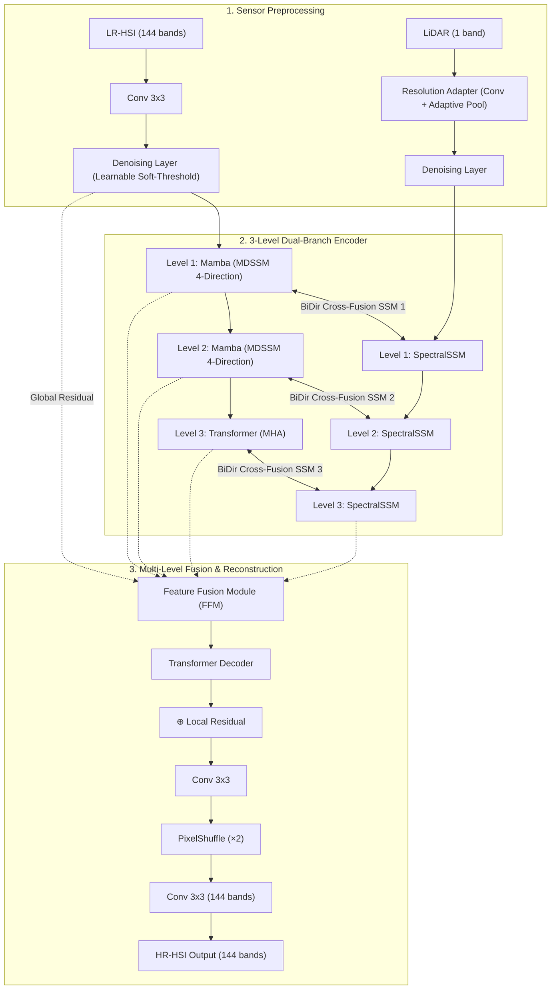

# FusMamba-SR v2: Adaptive Multi-Modal Satellite Image Super-Resolution Using Hybrid Deep Learning

[](https://www.python.org/)
[](https://pytorch.org/)
[]()
[-purple.svg)]()
[]()

> **B.Tech Project Presentation & Research Repository**  
> **Student**: Vujja Punith Sai (S20240010260)  
> **Guide**: Dr. Viswanath  
> **Institution**: Indian Institute of Information Technology, Sri City (IIIT Sri City)  
> **Presentation Slides**: [`PPTs/FusMamba_SR_v2_Slides.pptx.pdf`](PPTs/FusMamba_SR_v2_Slides.pptx.pdf)

---

## 📌 Executive Summary

Most open-source Earth observation and remote sensing satellites suffer from coarse spatial resolution due to optical and hardware tradeoffs. While multi-sensor fusion provides an opportunity to enhance resolution, satellite sensors differ substantially in **spatial resolution**, **spectral characteristics**, **noise profiles**, and **temporal/spatial alignment**.

**FusMamba-SR v2** introduces an adaptive, ultra-lightweight hybrid deep learning architecture designed for **Hyperspectral (HSI) + Light Detection and Ranging (LiDAR)** multi-sensor super-resolution ($\times 2$). By pairing State Space Models (**Mamba**) with **Vision Transformers**, FusMamba-SR v2 achieves linear $\mathcal{O}(N)$ computational complexity during feature extraction while retaining global relational modeling, delivering state-of-the-art super-resolution with only **564K parameters**.

---

## 🚀 Key Innovations & Contributions

FusMamba-SR v2 introduces six core innovations addressing the fundamental limitations of prior remote sensing fusion models:

1. **First Hybrid Mamba-Transformer for Multi-Sensor HSI-SR**  
   Combines linear-time Mamba layers in early encoder stages (for fast, efficient representation learning across 144 spectral bands) with Transformer Multi-Head Self-Attention in deep stages (for global contextual refinement).

2. **Bidirectional Cross-Fusion SSM**  
   Unlike unidirectional fusion methods (such as CSFMamba), our cross-fusion mechanism enables continuous bidirectional information exchange across all 3 encoder stages:
   - **Path 1 (LiDAR $\rightarrow$ HSI)**: LiDAR structural and elevation cues guide HSI spatial processing (*"Where are the sharp edges and contours?"*).
   - **Path 2 (HSI $\rightarrow$ LiDAR)**: HSI spectral signatures guide LiDAR feature refinement (*"What materials and spectral profiles exist here?"*).
   - Gated with SiLU, concatenated, and projected back to update both feature streams.

3. **Sensor-Adaptive Preprocessing Pipeline**  
   - **Resolution Adapter**: Utilizes dual $3\times3$ convolutions followed by adaptive pooling to automatically reconcile mismatched spatial resolutions between LiDAR and HSI sensors.
   - **Denoising Layer**: Implements learnable soft-thresholding per channel ($\tau$) via depthwise-separable convolutions to attenuate sensor-specific noise:
     $$\mathbf{y} = \text{sign}(\mathbf{x}) \cdot \max(|\mathbf{x}| - \tau, 0)$$

4. **Hierarchical Multi-Level Feature Fusion (FFM)**  
   Aggregates 6 feature streams from across the network (`f_shallow`, `hsi_f1`, `hsi_f2`, `hsi_f3`, `lid_f3`, `fusion_out`) through Depthwise-Separable Convolutions, preserving fine-grained spatial and spectral textures.

5. **QuadLoss: 4-Domain Training Objective**  
   Optimizes reconstruction simultaneously across spatial, frequency, spectral, and perceptual domains:
   $$\mathcal{L}_{\text{total}} = \mathcal{L}_{\text{MSE}} + 0.1 \cdot \mathcal{L}_{\text{FFT}} + 0.01 \cdot \mathcal{L}_{\text{SAM}} + 0.05 \cdot \mathcal{L}_{\text{SSIM}}$$

6. **Ultra-Compact Footprint**  
   With only **564,992 parameters**, FusMamba-SR v2 is nearly **50% smaller than FusionMamba (~1M)** and **70% smaller than HSRMamba (~2M)** while outperforming baseline approaches.

---

## 🏗️ Architecture Overview



### Multi-Directional Selective Scanning (MDSSM)
Mamba processes sequential inputs in 1D, but remote sensing imagery contains intricate 2D spatial correlations. FusMamba-SR v2 incorporates **Multi-Directional Selective Scanning (MDSSM)** across 4 trajectories:
1. **Forward Row**: Left $\rightarrow$ Right, Top $\rightarrow$ Bottom
2. **Reverse Row**: Right $\rightarrow$ Left, Bottom $\rightarrow$ Top
3. **Forward Column**: Top $\rightarrow$ Bottom, Left $\rightarrow$ Right
4. **Reverse Column**: Bottom $\rightarrow$ Top, Right $\rightarrow$ Left

Channels are partitioned across the 4 scanning pathways to maximize spatial context capture while preserving efficiency.

---

## 🎯 QuadLoss Objective Function

To avoid the over-smoothing typical of standalone MSE/L1 loss functions, FusMamba-SR v2 employs **QuadLoss**, constraining 4 distinct quality domains:

$$\mathcal{L}_{\text{total}} = \mathcal{L}_{\text{MSE}} + 0.1 \cdot \mathcal{L}_{\text{FFT}} + 0.01 \cdot \mathcal{L}_{\text{SAM}} + 0.05 \cdot \mathcal{L}_{\text{SSIM}}$$

| Component | Domain | Weight | Purpose |
|:---|:---|:---:|:---|
| **$\mathcal{L}_{\text{MSE}}$** | Pixel (Spatial) | $1.0$ | Ensures pixel-wise numerical fidelity and ground-truth convergence |
| **$\mathcal{L}_{\text{FFT}}$** | Frequency | $0.1$ | Computes $\ell_1$ distance in Fourier frequency space to restore high-frequency edges & fine textures |
| **$\mathcal{L}_{\text{SAM}}$** | Spectral | $0.01$ | Spectral Angle Mapper — enforces spectral curve angle fidelity across all 144 bands |
| **$\mathcal{L}_{\text{SSIM}}$** | Structural | $0.05$ | Preserves luminance, contrast, and structural perceptual cohesion |

$$\text{SAM}(\mathbf{y}, \hat{\mathbf{y}}) = \arccos\left(\frac{\langle\mathbf{y}, \hat{\mathbf{y}}\rangle}{\|\mathbf{y}\|_2 \|\hat{\mathbf{y}}\|_2}\right)$$

---

## 📊 Experimental Setup & Results

### Dataset: Houston 2013 (IEEE GRSS Data Fusion Contest)
- **Hyperspectral (HSI)**: ITRES CASI-1500 sensor, 144 spectral bands ($380\text{--}1050\text{ nm}$), $349 \times 1905$ pixels, $2.5\text{ m}$ GSD
- **LiDAR**: Optech Gemini sensor, 1 band elevation data, co-registered
- **Training Samples**: 2,360 patches ($32 \times 32$ HR downsampled to $16 \times 16$ LR for $\times 2$ scale)
- **Augmentation**: Random horizontal and vertical flips ($p=0.5$)

### Training Configuration
- **Total Parameters**: 564,992 (~564K)
- **Embedding Dimension**: 48 (6 attention heads, $d_{\text{state}}=16$)
- **Optimizer**: Adam ($\beta_1 = 0.9, \beta_2 = 0.99$, weight decay $0$)
- **Learning Rate**: $2 \times 10^{-4}$ with MultiStepLR schedule
- **Batch Size**: 8 (Patch Size: $32 \times 32$)
- **Precision**: Automatic Mixed Precision (AMP FP16)
- **Hardware**: NVIDIA T4 GPU (16 GB VRAM)

### Model Benchmark Comparison

| Model | Modality & Task | Parameters | Performance Metric |
|:---|:---|:---:|:---|
| **SRMamba-T** *(Baseline)* | Single-Image HSI-SR | 653K | 33.20 dB (Urban100) / 21.05 dB (PaviaC) |
| **FusionMamba** | Multi-Modal RS Fusion | ~1M | 35.63 dB (Pavia) |
| **HSRMamba** | Single HSI-SR | ~2M | 40.28 dB (Chikusei) |
| **FusMamba-SR v2** *(Ours)* | **Multi-Modal HSI + LiDAR SR** | **564K** *(Lowest)* | **36.91 dB PSNR** *(Houston 2013)* |

---

## 📁 Repository Structure

```
MultiModal-Satellite-Image-Fusion/
├── Baseline_Model/                        # Baseline implementation (SRMamba-T)
│   ├── Code/                              # Training & evaluation scripts for SRMamba-T
│   │   ├── srmamba_t_kaggle_notebook.py   # Training script (PaviaU, Kaggle T4x2)
│   │   ├── srmamba_t_kaggle_paviac.py     # Training script (PaviaC, Kaggle T4x2)
│   │   ├── srmamba_t_colab_test.py        # Testing script for Colab
│   │   └── srmamba_t_testing_notebook.py  # Inference & evaluation notebook
│   ├── Models/                            # Baseline pretrained checkpoints
│   │   ├── PaviaC/                        # Pavia Centre (x2, x3, x4 models)
│   │   ├── PaviaU/                        # Pavia University (x2, x3, x4 models)
│   │   └── daeu_paviaC.pth                # DAEU comparative model
│   ├── Results/                           # Baseline metrics & comparisons
│   │   └── PaviaC/README.md               # Per-patch PSNR/SSIM evaluation
│   └── README.md                          # Baseline model documentation
├── PPTs/                                  # Presentation slide decks
│   ├── FusMamba_SR_v2_Slides.pptx.pdf     # Primary project presentation (FusMamba-SR v2)
│   ├── Adaptive_Multi_Modal_SR_Fixed.pdf  # Project slides (v1)
│   └── Adaptive_Multi_Modal_SR_Fixed_Canva.pptx
├── .gitignore
└── README.md                              # Main repository documentation (this file)
```

---

## 📚 Baseline Model Reference

The baseline single-image super-resolution model adapted for hyperspectral data is organized under [`Baseline_Model/`](Baseline_Model/).

For full details on the baseline SRMamba-T implementation, training pipeline, and PaviaC / PaviaU benchmarks, refer to the [Baseline Model README](Baseline_Model/README.md).

---

## 🔮 Future Directions

- **Scale Extension**: Scaling FusMamba-SR v2 to $\times 4$ and $\times 8$ magnification factors.
- **Real-World Degradation**: Modeling complex atmospheric scattering, sensor point-spread function (PSF) blur, and sensor noise.
- **CUDA Acceleration**: Integrating custom CUDA kernels for selective state space scanning to achieve up to $10\times$ inference speedup.
- **Cross-Dataset Generalization**: Benchmarking across Chikusei, Washington DC Mall, and Botswana datasets.
- **Additional Modalities**: Integrating Synthetic Aperture Radar (SAR) as a third complementary imaging modality.

---

## 📄 License & Attribution

This project is developed for academic research at **IIIT Sri City**.  
If you reference this work or presentation, please cite:

```bibtex
@misc{vujja2026fusmambasr,
  author       = {Vujja Punith Sai and Dr. Viswanath},
  title        = {Adaptive Multi-Modal Satellite Image Super-Resolution Using Hybrid Deep Learning (FusMamba-SR v2)},
  institution  = {Indian Institute of Information Technology, Sri City},
  year         = {2026}
}
```
